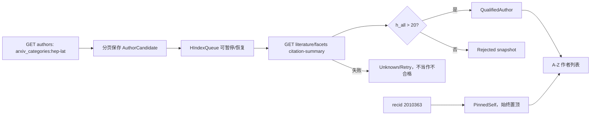

# INSPIRE 文献管理器（macOS）开工方案 v1

> 工作名：**LatticeLens**  
> 方案版本：v1.0  
> 日期：2026-08-22  
> 项目目录：`~/Desktop/Reference_manager`  
> 当前阶段：产品与工程开工方案，尚未创建 Xcode 工程或声称完成运行验证

## 0. 一页结论

v1 建议做成一个原生 macOS 三栏工作台，而不是把 INSPIRE 网页简单套进 WebView：

1. 左栏是作者索引：固定把 INSPIRE author recid `2010363` 放在最前面的“我的主页”，其余符合条件的作者按姓氏首字母 A–Z 分组，并支持英文名、native name 和 INSPIRE BAI 搜索。
2. 中栏是当前作者的文献时间线：本地同步、按年份分组、标记新增/未读，显示 arXiv category、发表状态、引用数和同步时间。
3. 右栏是“AI 论文镜头”：选择论文后立即展示原始 metadata；选中稳定约 600 ms 后自动开始 LLM 分析。右栏用 `概览 / 物理解释 / 重要图像 / 原始资料` 四个 tab，持续显示当前证据范围、调用次数、流式进度、耗时和取消按钮。

v1 的核心数据约定如下：

- “hep-lat 作者候选”定义为当前 INSPIRE author record 的 `arxiv_categories` 包含 `hep-lat`；这与“历史上任何一篇论文曾 cross-list 到 hep-lat 的全部合作者”不是同一个集合。
- “h 因子大于 20”默认定义为 INSPIRE citation summary 的 `h-index.value.all > 20`，即严格大于 20、all citeable papers、默认不排除自引；同时缓存并展示 `published` 口径和快照日期。
- 用户本人无论 h-index 是否达到阈值，都固定置顶；其他作者必须已经成功取得 h-index 且满足阈值才进入正式列表。失败或尚未计算的作者不能被误标为不满足条件。
- 重要图像必须来自 INSPIRE `metadata.figures` 的真实 URL；v1 文本模型只根据 figure caption/label 选择图像并解释，不声称看过图像像素。未来的 vision 模式必须单独标注。

## 1. 已实时验证的事实与边界

以下结论在 2026-08-22 对当前公开服务做过只读请求验证；它们是实现输入，不应当被硬编码为永久不变的服务契约。

### 1.1 直接验证结果

| 项目 | 当前验证结果 | v1 处理 |
| --- | --- | --- |
| 用户作者记录 | `GET /api/authors/2010363` 可返回作者名、native name、INSPIRE BAI、ORCID、positions 和 `arxiv_categories` | 以 recid `2010363` 作为唯一稳定的“我”标识，不以姓名做主键 |
| hep-lat 作者搜索 | `GET /api/authors?q=arxiv_categories:hep-lat&size=250&page=...` 可分页；本次快照返回 1776 条 | 总数只作快照，不写死；遍历 `links.next` |
| author h-index 字段 | 当前 author metadata 没有 `h_index` 或 `citation_count` | 禁止假设作者搜索可以直接按 h-index 过滤 |
| citation summary | `GET /api/literature/facets?q=authors.recid:<recid>&facet_name=citation-summary` 返回 `h-index.value.all/published` | 封装为独立 `HIndexProvider`；记录口径、时间和原始响应版本 |
| 排除自引 | 同一 facets 请求加入 `exclude-self-citations=true` 会返回另一套结果 | v1 默认关闭；设置中明确显示口径，不能把两种数值混用 |
| 作者论文 | `GET /api/literature?q=authors.recid:<recid>&sort=mostrecent&size=...` 返回分页结果 | 按 INSPIRE record id upsert；不要用标题去重 |
| 论文详情 | 文献 record 可提供 titles、abstracts、authors、arXiv eprints、citation count、documents 和 figures | 原始字段保留来源，例如 arXiv、APS、IOP |
| 图像 | `metadata.figures` 可包含 `key/url/label/caption/source/material/filename` | figure `key` 是 LLM 选择 allowlist；URL 仅按需加载并保留来源 |
| HTTP 缓存提示 | 单条 author 响应当前有 `ETag` 和 `Last-Modified`；公开响应声明可暴露 rate-limit headers | 只在 header 实际存在时使用；搜索结果不能假设一定有 ETag |

### 1.2 尚不能承诺的部分

- `/api/literature/facets` 是当前 INSPIRE 前端实际使用且本次可调用的 endpoint，但 v1 应把它视作可能演化的服务边界。若它变化，fallback 是拉取该作者按 `mostcited` 排序的全部论文并用

  \[
  h=\max\{k\mid c_{(k)}\ge k\}
  \]

  本地复算，同时在 UI 标明 `locally computed`，不能静默冒充 INSPIRE 官方 summary。

- author record 的 `arxiv_categories: hep-lat` 是一个可实现、可审计的候选定义，但不保证覆盖“所有曾在任意 hep-lat cross-list 论文署名的人”。如果后续要求严格历史全集，需要另做全量 literature crawl、author recid 去重和覆盖审计。
- INSPIRE metadata 能支持“摘要级物理解释”；仅凭标题、摘要和 figure captions 不能可靠复现全文中的拟合策略、格点参数、系统误差预算或所有约定。没有全文证据时，界面必须显示“摘要级解释”。
- 真实 LLM provider、模型的结构化输出兼容性、SSE 行为、vision 能力和费用尚未验证，必须分别验收，不能由 mock 测试外推。

## 2. v1 产品范围

### 2.1 P0：必须交付

- 原生 SwiftUI macOS 应用，部署目标建议 macOS 14.0，与 Speech2AI 当前工程基线保持一致。
- 固定用户 recid `2010363`，始终置顶。
- 构建并可恢复地更新 hep-lat 作者候选索引。
- 逐作者取得并缓存 INSPIRE h-index，正式作者列表只显示 `h_all > 20` 的已验证结果。
- 作者姓名搜索、A–Z section、同步状态和最后更新时间。
- 选择/关注作者，分页同步其全部 INSPIRE 文献；在 app 启动和手动刷新时做增量 upsert。
- 选择文献后自动生成中文标题、摘要翻译、摘要级物理解释和重要图像选择。
- 原文与 LLM 产物并存；任何 LLM 失败不得影响原始文献浏览。
- Provider/Base URL/API Key/model/streaming 设置复用 Speech2AI 的安全与交互模式。
- 本地持久化、离线浏览、取消、重试、错误分层、缓存清理。
- unit、integration、UI fixture tests；live INSPIRE 和 live provider 验收单独记录。

### 2.2 P1：v1 完成后再做

- PDF/LaTeX 全文提取及带页码/章节 anchor 的“全文级解释”。
- vision 模型真实查看图像像素，并与 caption-only 结果分栏显示。
- BibTeX/Markdown reading note 导出、批量标签、智能 collection。
- 引用变化与新论文的系统通知。
- iCloud/CloudKit 多机同步。
- collaboration network、主题聚类、citation graph。
- Developer ID 签名、公证、自动更新或 Mac App Store 发布。

### 2.3 明确不做

- 不修改 INSPIRE 线上记录，不自动代替用户提交 metadata。
- 不抓取或向 LLM 发送作者邮箱、positions 等与论文解释无关的信息。
- 不生成或伪造“论文原图”；v1 只展示来源可追踪的 INSPIRE figure。
- 不把模型解释当作论文原结论，不在没有 source anchor 时写出精确数值、格点参数或统计显著性。

## 3. 展示方案：Author Atlas + Paper Lens

### 3.1 主窗口

推荐使用 `NavigationSplitView`/`HSplitView` 组成三栏；默认窗口约 `1440 × 900`，允许左栏和中栏折叠，右栏优先保留阅读空间。

```text
┌──────────────────────────────────────────────────────────────────────────────────────────────┐
│ LatticeLens   [全局搜索]                         INSPIRE ●在线   DeepSeek · model-x   [设置] │
├──────────────────────┬─────────────────────────────┬─────────────────────────────────────────┤
│ AUTHORS              │ DIAN-JUN ZHAO               │ 论文中文标题                            │
│ [搜索姓名/BAI……]     │ 10 papers  [↻ 同步] [☆关注] │ Original English Title                  │
│                      │                             │ arXiv:2412...  hep-lat  引用 4  [INSPIRE]│
│ ★ 我的主页           │ 2026                        ├─────────────────────────────────────────┤
│   Dian-Jun Zhao      │ ● New paper title...        │ [概览] [物理解释] [重要图像] [原始资料] │
│   recid 2010363      │   arXiv · hep-lat · 3 Mar  │                                         │
│                      │                             │ 证据范围：标题 + 摘要 + figure captions │
│ A                    │ 2025                        │ 状态：正在接收 · 1 次请求 · 8 s [取消] │
│   Aoki, Sinya  h 67  │   Paper title...            │                                         │
│   Alexandrou... h 52 │   Paper title...            │ 研究问题                                │
│ B                    │                             │ 方法与数据流                            │
│   Bali, Gunnar h 70  │                             │ 主要结论 / 限制                         │
│ ...                  │                             │                                         │
│ 索引 824/1776        │ 上次同步 2 min ago          │ [重新生成 ▾] [复制] [导出 Markdown]     │
└──────────────────────┴─────────────────────────────┴─────────────────────────────────────────┘
```

示意姓名和 h 值只是布局占位，不是本方案验证过的真实数据；实现和截图 fixture 必须使用明确标注的 mock 值。

### 3.2 左栏：作者列表

- 顶部固定 section：`★ 我的主页`，显示本人 preferred/native name、recid 和同步状态，不显示“不满足 h>20”之类会干扰置顶语义的标签。
- 其余作者按 `metadata.name.value` 的逗号前 family-name 归一化排序；A–Z 以外进入 `#` section。
- 搜索匹配 `preferred_name`、`name.value`、`native_names`、INSPIRE BAI；大小写、连字符和重音符号做搜索归一化，但原始姓名不改写。
- 每行只保留三项高价值信息：姓名、h-index badge、关注/同步状态。hep-lat category 和统计口径放在 hover/inspector，避免列表过密。
- h-index badge 的 tooltip 明确写 `INSPIRE h(all), self-citations included, updated <date>`。
- 索引还没完成时在列表底部显示 `已验证 / 候选总数 / 失败数`，避免给用户“当前已是全集”的错觉。

### 3.3 中栏：作者论文时间线

- 顶部是作者 header：native/preferred name、INSPIRE 外链、h(all)/h(published)、论文数、关注和同步按钮。
- 论文按 `preprint_date`/`earliest_date` 降序，按年份做 sticky header。
- row 显示原始标题、arXiv id、primary category、publication status、citation count；新同步记录有蓝点，已读后消失。
- toolbar 提供 `全部 / hep-lat / 已发表 / 新增 / 有图像` filter。
- 选中论文后先从本地 metadata 瞬时渲染右栏；网络详情和 LLM 是后续独立状态，不制造空白等待页。

### 3.4 右栏：AI Paper Lens

四个 tab 的职责固定：

1. `概览`：中文标题、原始标题、中文摘要、可折叠的原始摘要、来源 badge。
2. `物理解释`：研究问题、物理背景、方法/数据流、主要结果、格点 QCD 约定与局限。若 source 中没有格点尺寸、作用量、质量、重整化 scheme、傅里叶或 source/sink 约定，就明确列为“原始摘要未提供”。
3. `重要图像`：左侧 thumbnail rail，右侧大图；展示原始 caption、中文 caption、LLM 选择理由和 `caption-based` badge。图片点击后进入原尺寸 Quick Look 风格窗口。
4. `原始资料`：titles/abstracts 各来源、authors、arXiv categories、DOI/publication info、documents、INSPIRE JSON/网页链接和最近更新时间。

视觉建议采用 macOS system material + 深海蓝/格点青作轻量 accent；引用变化用 amber，只把红色用于错误。所有状态同时用文字或 SF Symbol 表达，不依赖颜色。数学公式由本地打包的 KaTeX/MathJax 资源渲染，不能运行远程脚本；原始 LaTeX 始终可复制。

## 4. 作者索引与 h-index 数据流



实现规则：

- 第一次启动优先加载本人和本地缓存；作者索引在后台构建，不阻塞主窗口。
- 候选分页和 h-index 队列各有 checkpoint。退出或断网后从最后成功位置恢复，不能从头重复轰击 API。
- 默认最多两个 h-index 请求并发；如果服务返回 rate-limit/retry 信息则动态降速。具体速率由实测决定，不在方案中假定服务上限。
- `HIndexSnapshot` 保存 `all/published`、是否排除自引、query、fetchedAt、source=`INSPIRE`、raw schema version/hash。
- 阈值判断只用同一口径：`h_all > 20`。`20` 不合格，`21` 合格；unit test 必须覆盖边界。
- 重新构建索引时保留上一版可用列表，逐项替换；不能先清空造成全列表闪烁。
- 若 facets endpoint 失效，先显示旧快照和 `stale` 状态，再进入显式 fallback；不能用 `0` 代替未知。

## 5. 文献同步策略

### 5.1 行为

- 单击作者：读取本地论文；若从未同步则自动同步。
- 点击 `☆ 关注`：加入 tracked author。app 启动后在前台空闲时刷新所有 tracked authors；另有明确的手动刷新。
- 同步 query：`authors.recid:<recid>`，排序 `mostrecent`，遍历 `links.next`。
- 每条论文以 INSPIRE literature record id 唯一 upsert，并比较服务端 `updated`；作者—论文关系使用 join model，避免同一论文重复保存。
- 新论文判定基于本地首次看到的 record id，不基于 arXiv 日期；更新过的旧论文显示 `metadata updated` 而不是伪装成新论文。
- 文献列表只同步 metadata；单条详情和 figures 在选中时按需获取。图像 lazy-load，失败不会阻塞文本。

### 5.2 状态机

`idle → loadingLocal → syncingMetadata → ready`，并允许：

- `ready(stale)`：有本地数据但刷新失败；继续离线浏览。
- `partial(page, checkpoint)`：分页中断；保留已成功页并可恢复。
- `cancelled`：用户取消；不回滚已成功的幂等 upsert。
- `failed(noLocalData)`：首次同步完全失败；显示可操作的重试和 INSPIRE 外链。

### 5.3 缓存与一致性

- author 单记录在服务提供 ETag 时发 `If-None-Match`；搜索/文献分页只在实际响应 header 支持时采用条件请求。
- 所有数据库写入走单独 actor/model context，UI 只接收不可变 snapshot。
- 同步批次记录 query、页数、开始/结束时间、成功/失败计数，不记录 API Key 或完整 LLM payload。
- 数据库 schema 必须版本化；升级前做轻量备份，失败时保留旧库并给出恢复路径。

## 6. LLM 自动分析

### 6.1 触发与缓存

- 默认开启“选择论文后自动分析”。选择稳定约 600 ms 后触发，快速上下移动列表不会为每一行发请求。
- 优先查询本地 `InsightArtifact`。cache key 至少包含：`paperID + paper.updated + promptVersion + provider + normalizedBaseURL + model + mode + detailLevel + figureSetHash`。
- cache 命中时零请求立即展示；用户可点“重新生成”。取消或失败保留上一次成功 artifact。
- 若没有 abstract，只翻译标题并显示“无摘要，无法生成可靠物理解释”；不得用标题扩写成论文结论。

### 6.2 两种模式

| 模式 | 请求数 | 输入 | 用途 |
| --- | ---: | --- | --- |
| Fast（默认） | 1 | title + preferred abstract + bibliographic metadata + figure key/label/caption | 一次生成翻译、摘要级解释和 caption-based 重要图像 |
| Deep | 2 | 第一次做忠实翻译；第二次携带原始资料和通过验证的翻译做物理解释/图像选择 | 更易隔离翻译与解释失败；仍不是全文审读 |

界面必须像 Speech2AI 一样直接写明“会发送 1 次/2 次 LLM 请求”，并显示 `connecting / waiting / receiving / validating`、elapsed time、received characters 和取消按钮。不允许 SSE 失败后静默再发一次 non-streaming 请求。

### 6.3 结构化输出契约

Prompt source material 作为不可信 JSON user payload 发送，不拼进 system prompt。建议的严格响应结构：

```json
{
  "schema_version": "paper-insight-v1",
  "source_scope": "title_abstract_figure_captions",
  "title_zh": "...",
  "abstract_zh": "...",
  "physics": {
    "research_question": "...",
    "background": "...",
    "method_and_data_flow": ["..."],
    "main_results": ["..."],
    "lattice_conventions_reported": ["..."],
    "missing_information": ["..."],
    "caveats": ["..."]
  },
  "important_figures": [
    {
      "figure_key": "key supplied in source payload",
      "caption_zh": "...",
      "why_important": "...",
      "evidence_mode": "caption_only"
    }
  ],
  "terminology": [
    {"source": "RI/MOM", "zh": "...", "note": "..."}
  ]
}
```

Validator 规则：

- 首字节到完整 JSON 都做大小、控制字符、重复 key 和类型检查。
- `figure_key` 必须属于本次 payload allowlist；未知 key 整段丢弃，绝不拼接成任意 URL。
- 重要图像数量受本地设置限制，默认最多 3 张。
- `source_scope` 只能取 app 给定枚举；模型不能自行宣称读过全文或看过像素。
- 物理解释中出现精确格点参数、误差或结论时，必须能锚定原摘要/caption；无法锚定的内容移入 `caveats` 或拒收。
- JSON 不兼容时不“尽力解析”混合内容；保留原文，显示 schema error，并允许用同一 frozen snapshot 重试。

### 6.4 物理解释模板

对于 lattice/LaMET 论文，解释按以下顺序组织，但只填 source 支持的部分：

1. 研究对象：PDF/DA/GPD/TMD、form factor、spectrum、renormalization 等。
2. 观测量与数据流：Euclidean correlator → matrix element → renormalization → Fourier/matching/extrapolation。
3. 方法贡献：新 observable、求解器、operator、拟合或系统误差处理。
4. 关键约定：格点维度、Euclidean gamma、边界条件、动量/傅里叶符号、source/sink、复共轭、单位和 scheme。
5. 结果与证据：只复述摘要/caption 支持的结论。
6. 未知量：正文未接入时明确列出 lattice spacing、volume、ensemble、statistics、fit range、residual/precision 等缺口。

这样可以把“原文直接支持”“模型解释”“缺失信息”在视觉上分开，而不是输出一段无法审计的通顺中文。

## 7. LLM 设置界面：复用 Speech2AI 的成熟模式

从 `~/Desktop/Speech2AI` 复用设计思想和可抽取代码，而不是直接复制整个 app：

- Provider profile：`OpenAI`、`DeepSeek`；Base URL 可编辑，因此也覆盖 OpenAI-compatible custom endpoint。
- 每个 provider 独立保存 Base URL、selected/manual model 和 SSE capability。
- API Key 只存 macOS Keychain；输入后不回显，不进 UserDefaults、日志、导出或截图 fixture。
- `GET /models`、模型名称搜索、已发现模型 picker、手工 model ID fallback。
- Release 只允许 HTTPS；Debug 仅允许 `localhost/127.0.0.1` 的 HTTP；拒绝 URL 中的 user/password、query 和 fragment。
- Streaming capability 是显式 toggle；一次请求只走一种 transport。
- terminology list 可复用，用于固定 `LaMET`、`quasi-PDF`、`RI/MOM`、`source/sink` 等 preferred spelling。

论文专用参数放在主工作台上方的 compact control bar：

- `模式：Fast / Deep`
- `详细度：简洁 / 标准 / 详细`
- `重要图像：0 / 3 / 5`
- `自动分析：开 / 仅手动`
- `证据范围：摘要+captions`（v1 只读 badge，不伪装成可用的全文选项）

Speech2AI 当前请求模型只包含 `model/messages/stream`，未暴露 temperature、top_p 或 token budget。v1 延续这个兼容性选择，不在主 UI 添加 provider 未必共同支持的高级参数；若以后需要，先建立 capability layer 和 provider-specific tests。

## 8. 技术架构

### 8.1 推荐栈

- UI：SwiftUI + 少量 AppKit/`WKWebView` wrapper。
- 并发：Swift Concurrency，`Sendable` model、actor-isolated network/database services，开启 strict concurrency。
- 持久化：SwiftData（macOS 14）+ schema migration plan；后台写入使用专用 `@ModelActor` repository。
- 网络：`URLSession`、自定义 `URLProtocol` fixtures、SSE parser。
- 密钥：Security.framework / Keychain。
- 数学与 Markdown：本地 bundled renderer，禁止远程 script；外链交给 `NSWorkspace`。
- 图像：`URLCache` + 内存 `NSCache`；只缓存已查看图像，可在设置中清理。
- 日志：`os.Logger`，只记录 record id、阶段、计数、耗时和错误类别；敏感 payload 做 redaction。

### 8.2 模块边界

```text
LatticeLens/
├── App/                       # App entry、commands、dependency container
├── Core/
│   ├── Models/                # API DTO 与持久化 model 分离
│   ├── Persistence/           # SwiftData schema、migration、repositories
│   ├── Networking/            # HTTP client、pagination、retry、redaction
│   └── Support/               # clocks、hashing、normalization、errors
├── Features/
│   ├── Authors/               # candidate index、h-index queue、A-Z/search
│   ├── Library/               # paper sync、filters、read state
│   ├── PaperLens/             # detail、tabs、figures、math rendering
│   └── Settings/              # INSPIRE/LLM/cache/privacy settings
├── LLM/
│   ├── Provider/              # OpenAI-compatible client、Keychain config
│   ├── Prompt/                # versioned prompt + source payload
│   ├── Schema/                # PaperInsightV1 strict decoder/validator
│   └── Workflow/              # state machine、stream、cancel、cache
├── Resources/
│   ├── Fixtures/              # 不含真实密钥的脱敏 JSON
│   └── MathRenderer/          # 本地资源及 license
├── LatticeLensTests/
└── LatticeLensUITests/
```

### 8.3 核心数据模型

| Model | 关键字段 |
| --- | --- |
| `Author` | `recid` unique、原始/显示/native name、BAI、categories、sortKey、isSelf、isTracked |
| `HIndexSnapshot` | author recid、all、published、excludeSelfCitations、source、query、fetchedAt、state |
| `Paper` | literature id unique、titles/abstracts with source、dates、arXiv/DOI、citation count、updated、raw hash |
| `PaperAuthor` | paper id、author recid、position/order |
| `Figure` | paper id、key unique within paper、URL、caption、label、source、filename |
| `InsightArtifact` | paper id、cache key、prompt/schema version、provider/model、source scope、validated JSON、createdAt |
| `SyncCheckpoint` | job kind、query、next URL/page、success/failure counts、lastCompletedAt |

不把完整 API response 只塞进一个 opaque blob；保留必要规范化字段，同时可选择保存脱敏 raw JSON hash/小型 snapshot 以便审计和迁移。

## 9. 隐私、安全与失败语义

- 选中论文后自动调用 LLM，必须在首次使用时明确告知：论文标题、摘要、bibliographic metadata 和 figure captions 会发送到当前 endpoint；图像像素在 v1 不发送。
- API Key 只在 Keychain。切换 provider、Base URL、model 或 credential revision 会使进行中的 frozen session 失效。
- endpoint 重定向需重新检查 scheme/host；错误文本和日志不得包含 Authorization、Key、完整 abstract 或生成结果。
- 论文文本视作不可信数据：其中的命令式内容不能改变 system instruction、endpoint 或本地文件权限。
- 网络失败、LLM 失败、schema validation 失败、图像失败是四类独立状态；任何一类不得清空其他已成功数据。
- 数据删除分层：`清除 AI 结果`、`清除图像缓存`、`取消关注并删除本地论文`、`重置全部本地数据`， destructive action 必须显示精确范围。
- 外部链接只打开 `https` 且来源字段可见；不允许 LLM 生成的 URL 直接成为可点击来源。

## 10. 实施里程碑

### M0：工程骨架与不可变契约

- 创建 Xcode project、targets、strict concurrency/warnings-as-errors 配置。
- 定义 API DTO、domain model、error taxonomy、clock/network protocols。
- 固化脱敏 fixtures 和本方案中的筛选口径。

验收：无网络 unit tests 可运行；README 能说明 `h > 20`、hep-lat 和 self-citation 口径。

### M1：INSPIRE client 与作者索引

- author/detail/literature/facets endpoints、pagination、retry、cancel。
- SwiftData schema、checkpoint、HIndexQueue。
- self pin、A–Z、姓名搜索、unknown/qualified/rejected 状态。

验收：fixture 中 20 被排除、21 被纳入；失败作者保持 unknown；recid 2010363 始终置顶。

### M2：文献库与同步

- tracked author、论文分页 upsert、更新/新增区分、离线读取。
- 论文时间线、filters、同步进度和 stale UI。

验收：重复同步不产生重复论文；中途取消后可从 checkpoint 恢复。

### M3：LLM Provider 与严格 schema

- 抽取/改造 Speech2AI 的 endpoint builder、Keychain、model discovery、SSE workflow。
- PaperInsight prompt/schema/cache；Fast 自动分析和取消。
- provider/model/streaming/privacy settings。

验收：mock SSE/non-streaming、invalid JSON、unknown figure key、cancel、cache hit 全覆盖；无二次静默重试。

### M4：Paper Lens 与图像

- 四 tab 右栏、中文/原文对照、本地数学渲染。
- figure carousel、caption-based badge、Quick Look、lazy cache。
- Deep 两阶段模式、复制/Markdown 导出。

验收：无 figures/无 abstract/坏图 URL/多来源 abstract 均有明确降级 UI，不出现虚构占位内容。

### M5：本地候选包验收

- accessibility identifiers、VoiceOver manual pass、keyboard navigation。
- unit/integration/UI tests，Debug/Release build、analyze、archive。
- live INSPIRE smoke test 与用户授权后的 live provider matrix 分开记录。

验收：只有所有本地 gate 和已授权 live gate 有证据时，才称为相应范围的 candidate；不把 mock/本机签名等同于公证或公开发行。

## 11. 测试与验收矩阵

| 场景 | 自动验证 | 需要 live/manual | 通过标准 |
| --- | --- | --- | --- |
| author pagination | fixture + URLProtocol | 可选 live smoke | 不丢页、不重复、尊重 `links.next` |
| h-index 阈值 | unit | live spot check | `20` 排除、`21` 纳入、unknown 不等于 0 |
| 本人置顶 | unit + UI | 无 | 搜索/排序/刷新后仍在第一 section |
| 姓名搜索 | unit + UI | 无 | preferred/native/BAI、大小写和重音归一化正确 |
| 论文 upsert | unit + integration | live spot check | record id 唯一，旧论文更新不记作新论文 |
| 离线/分页中断 | integration | Network Link Conditioner 可选 | 可看旧数据、可恢复、不清库 |
| LLM transport | mock SSE/non-streaming | 每个 provider 单独 live | 一次请求一种 transport、可取消、无 key 泄漏 |
| Insight schema | unit/fuzz fixtures | live provider | invalid/越权 figure key fail closed |
| 物理内容 | golden fixtures + 人工 rubric | 物理人工审阅 | 直接证据、解释、缺失信息明确分栏 |
| 图像展示 | fixture/local image | live INSPIRE | 真实 source/key、caption badge、坏图可降级 |
| 可访问性 | UI identifiers | VoiceOver/manual | 核心流程键盘可达，状态不只靠颜色 |
| 发布 | build/test/analyze/archive | 签名/公证另验 | 证据范围与发布声明一致 |

建议的本地 gate（工程创建后再按真实 scheme 名调整）：

```bash
DEVELOPER_DIR=/Applications/Xcode.app/Contents/Developer \
xcodebuild -project LatticeLens.xcodeproj -scheme LatticeLens \
  -configuration Debug -destination 'platform=macOS,arch=arm64' \
  -derivedDataPath .codex-task-tmp-<run>/debug \
  CODE_SIGNING_ALLOWED=NO SWIFT_TREAT_WARNINGS_AS_ERRORS=YES \
  SWIFT_STRICT_CONCURRENCY=complete build

DEVELOPER_DIR=/Applications/Xcode.app/Contents/Developer \
xcodebuild -project LatticeLens.xcodeproj -scheme LatticeLens \
  -configuration Debug -destination 'platform=macOS,arch=arm64' \
  -derivedDataPath .codex-task-tmp-<run>/tests \
  CODE_SIGNING_ALLOWED=NO SWIFT_TREAT_WARNINGS_AS_ERRORS=YES \
  SWIFT_STRICT_CONCURRENCY=complete test
```

## 12. 建议的第一轮 issue 顺序

1. `P0-01` 固化筛选语义、DTO fixtures 和 API error taxonomy。
2. `P0-02` 创建工程、依赖容器、SwiftData v1 schema。
3. `P0-03` 实现 `InspireClient` + pagination + conditional request。
4. `P0-04` 实现 `HIndexProvider/HIndexQueue` + checkpoint。
5. `P0-05` 作者列表、self pin、A–Z、search、index progress。
6. `P0-06` tracked author 与 paper sync/upsert。
7. `P0-07` 三栏主 UI 和 paper metadata detail。
8. `P0-08` 抽取 Speech2AI LLM provider/Keychain/model discovery。
9. `P0-09` `PaperInsightV1` prompt/validator/cache/automatic trigger。
10. `P0-10` figures carousel、证据 badge、数学/Markdown renderer。
11. `P0-11` offline/error/accessibility/UI fixtures。
12. `P0-12` live acceptance ledger、README、local candidate packaging。

## 13. 开工前必须冻结的三个决定

本方案已经给出默认值，信息足够时可以直接按默认值开工：

1. **筛选口径**：默认 `author.arxiv_categories contains hep-lat` 且 `INSPIRE h(all, including self-citations) > 20`；本人例外置顶。
2. **LLM 自动行为**：默认 Fast、一次请求、选择稳定 600 ms 触发、caption-only 选图、最多 3 张。
3. **v1 证据边界**：默认只做标题+摘要+figure captions；PDF 全文和 vision 明确延后。

如果后续改变任意一项，需要先更新 fixture、cache key、UI disclosure 和 acceptance test，而不只改一行设置。

## 14. 参考来源

### INSPIRE 当前公开来源

- 作者记录：<https://inspirehep.net/api/authors/2010363>
- 作者页面：<https://inspirehep.net/authors/2010363>
- hep-lat 作者查询示例：<https://inspirehep.net/api/authors?q=arxiv_categories%3Ahep-lat&size=250&page=1>
- 作者文献查询示例：<https://inspirehep.net/api/literature?q=authors.recid%3A2010363&sort=mostrecent&size=25>
- citation summary 示例：<https://inspirehep.net/api/literature/facets?q=authors.recid%3A2010363&facet_name=citation-summary>
- INSPIRE paper search 帮助（含 h-index/citation summary 说明）：<https://help.inspirehep.net/knowledge-base/inspire-paper-search/>

### 本地设计参考

- `~/Desktop/Speech2AI/Speech2AI/Views/SettingsView.swift`
- `~/Desktop/Speech2AI/Speech2AI/Views/GenerationControlsView.swift`
- `~/Desktop/Speech2AI/Speech2AI/Services/OpenAICompatibleClient.swift`
- `~/Desktop/Speech2AI/Speech2AI/Services/APIEndpointBuilder.swift`
- `~/Desktop/Speech2AI/Speech2AI/Services/KeychainStore.swift`
- `~/Desktop/Speech2AI/Speech2AI/Models/AppSettings.swift`

复用时应提取通用 contract 并重新命名测试，不把 Speech、transcript 或项目说明书业务状态带进 LatticeLens。
